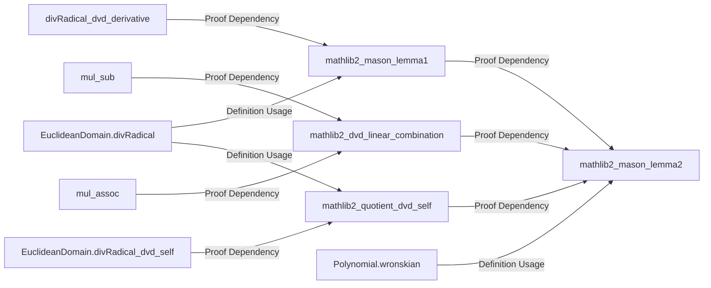

# Lemma 2 实际 Proof DAG

仅编译成功的本次脚本直接依赖；完整证据见 lemma2-dag.json。

```mermaid
flowchart LR
n0["mathlib2_mason_lemma1"]
n1["mathlib2_dvd_linear_combination"]
n2["mathlib2_quotient_dvd_self"]
n3["mathlib2_mason_lemma2"]
n4["divRadical_dvd_derivative"]
n5["EuclideanDomain.divRadical_dvd_self"]
n6["EuclideanDomain.divRadical"]
n7["Polynomial.wronskian"]
n8["mul_sub"]
n9["mul_assoc"]
n4 -->|Proof Dependency| n0
n6 -->|Definition Usage| n0
n8 -->|Proof Dependency| n1
n9 -->|Proof Dependency| n1
n5 -->|Proof Dependency| n2
n6 -->|Definition Usage| n2
n0 -->|Proof Dependency| n3
n1 -->|Proof Dependency| n3
n2 -->|Proof Dependency| n3
n7 -->|Definition Usage| n3
```

论文非零假设和定义对齐见 lemma2-alignment.md。未采用现成 divRadical_dvd_wronskian_left/right。