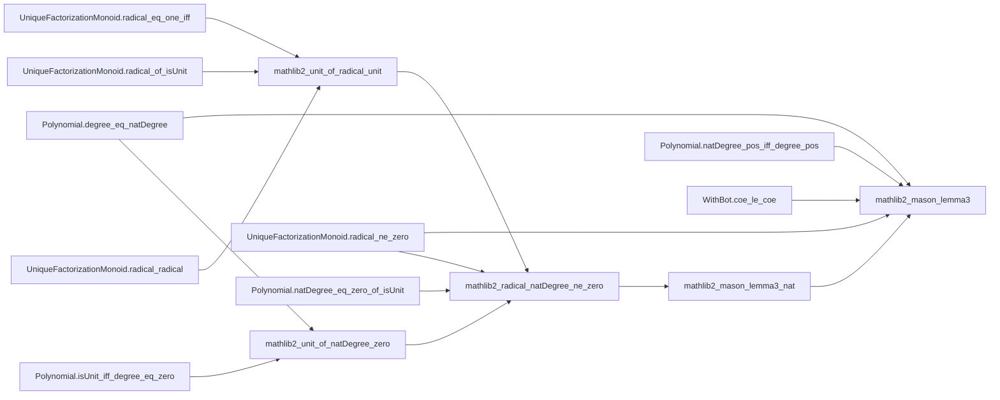

# Lemma 3 多层Proof DAG

来源及逐边原文证据见lemma3-dag.json；不是所有内核传递依赖。

```mermaid
flowchart LR
n0["mathlib2_unit_of_natDegree_zero"]
n1["mathlib2_unit_of_radical_unit"]
n2["mathlib2_radical_natDegree_ne_zero"]
n3["mathlib2_mason_lemma3_nat"]
n4["mathlib2_mason_lemma3"]
n5["Polynomial.isUnit_iff_degree_eq_zero"]
n6["Polynomial.degree_eq_natDegree"]
n7["UniqueFactorizationMonoid.radical_radical"]
n8["UniqueFactorizationMonoid.radical_of_isUnit"]
n9["UniqueFactorizationMonoid.radical_eq_one_iff"]
n10["UniqueFactorizationMonoid.radical_ne_zero"]
n11["Polynomial.natDegree_eq_zero_of_isUnit"]
n12["Polynomial.natDegree_pos_iff_degree_pos"]
n13["WithBot.coe_le_coe"]
n5 --> n0
n6 --> n0
n7 --> n1
n8 --> n1
n9 --> n1
n0 --> n2
n1 --> n2
n10 --> n2
n11 --> n2
n2 --> n3
n3 --> n4
n6 --> n4
n10 --> n4
n12 --> n4
n13 --> n4
```